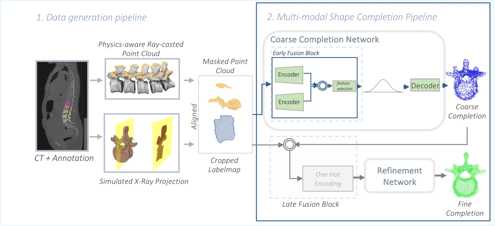

# US-X Complete: A Multi-Modal Approach to Anatomical 3D Shape Recovery 

## Description 
This repository publishes the code of the MICCAI 2025 ShapeMI Workshop Paper "US-X Complete: A Multi-Modal Approach to Anatomical 3D Shape Recovery".




## Installation
Install Anaconda, then use the following command: 

```
git clone --depth=1 https://github.com/miruna20/US-X-Complete.git
conda env create -f environment.yml 
```

## Usage 
+ cd ShapeCompletion/completion
+ For training: `python train.py --config cfgs/*.yaml` e.g `python train.py --config cfgs/vrcnet_train_local.yaml`
+ For testing: `python test.py --config cfgs/*.yaml` e.g `python test.py --config cfgs/vrcnet_test_local.yaml`
+ Configuration file for each algorithm can be found in `completion/cfgs/`

## Data
Both the synthetic vertebrae dataset and the datasets from two phantoms obtained through paired ultrasound X-ray acquisitions can be found at https://syncandshare.lrz.de/getlink/fi5STHyTaLSYSwwC42iDog/. 
To use these datasets, download them and place them in the ShapeCompletion/completion/datasets folder. 

## Network weights
The weights of our multimodal network can be found at https://syncandshare.lrz.de/getlink/fi4hJgCvKggP1vhPAFpECJ/
To use the weights, download the folder and place it in ShapeCompletion/completion/log/. 

## Citation
```
@inproceedings{gafencu2025us,
  title={US-X Complete: A Multi-modal Approach to Anatomical 3D Shape Recovery},
  author={Gafencu, Miruna-Alexandra and Velikova, Yordanka and Navab, Nassir and Azampour, Mohammad Farid},
  booktitle={International Workshop on Shape in Medical Imaging},
  pages={218--231},
  year={2025},
  organization={Springer}
}
```

## Acknowledgement
This implementation is based on the original work from the repository https://github.com/paul007pl/MVP_Benchmark. This code was adapted and expanded for our method.
